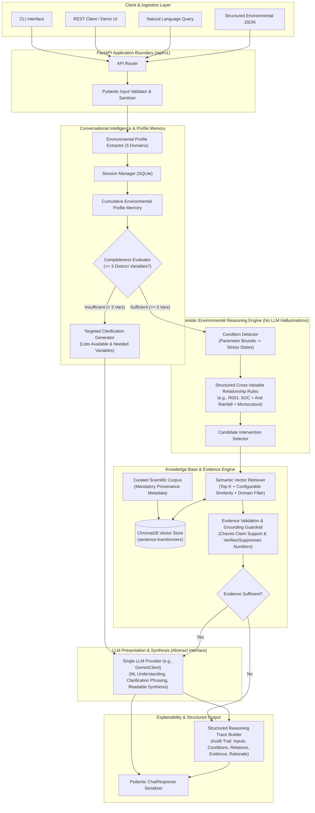
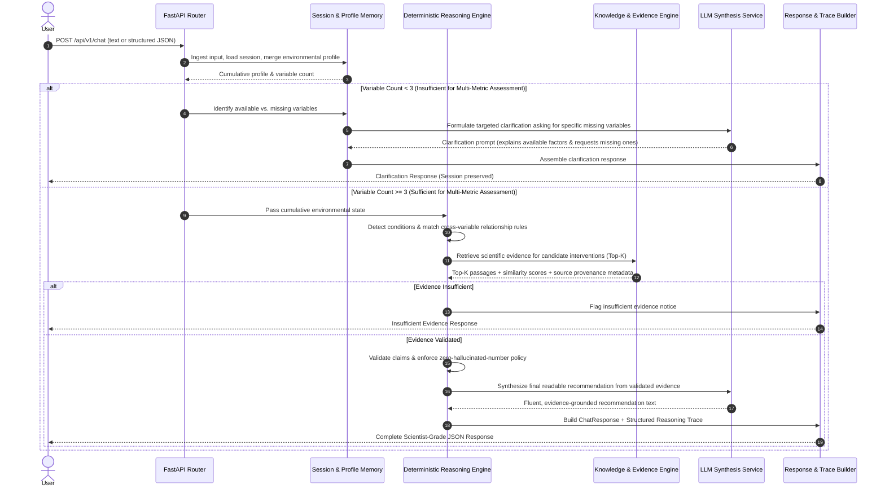

# Darukaa.Earth AI Biodiversity Intelligence System — Architecture Specification (Stage 1.5 Revised)

> **Status**: Stage 1.5 Architecture Corrections Applied  
> **Target Persona**: AI Environmental Scientist System  
> **Design Philosophy**: Depth of thinking, deterministic ecological reasoning, strict scientific evidence grounding, and auditable explainability. Built for robust, local-first execution within a 24-hour delivery timeline.

---

## 1. High-Level Architecture

The system decouples **conversational state tracking**, **environmental profile memory**, **deterministic multi-metric ecological reasoning**, **provenance-backed scientific retrieval**, and **natural language synthesis**.



---

## 2. Component Architecture

### Component A: Input Layer
- **Natural Language Handler**: Accepts freeform text inquiries from land stewards and researchers.
- **Structured JSON Handler**: Ingests validated key-value payloads (`EnvironmentalInputPayload`).
- **Environmental Profile Extractor**:
  - Extracts parameters across 5 core ecological domains:
    1. *Soil Health*: pH, organic carbon (SOC %), moisture, microbial activity.
    2. *Land Use / Land Cover*: Monoculture, crop rotation, agroforestry, fallow, forest canopy.
    3. *Biodiversity Indicators*: Species richness, habitat diversity, pollinator activity, pest pressure.
    4. *Climate & Hydrology*: Annual/seasonal rainfall, temperature regime, drought frequency.
    5. *Human Impact*: Chemical inputs (pesticides, synthetic N), deforestation, tillage, compaction.
- **Input Validator**: Pydantic v2 schemas validating physical parameter bounds (e.g., pH $\in [0, 14]$, SOC $\ge 0\%$).

### Component B: Conversational Intelligence & Memory
- **Session Manager**: SQLite-backed session persistence (`sessions.db`) tracking multi-turn dialogue history.
- **Cumulative Environmental Profile Memory**:
  - Accumulates and merges slot values across consecutive turns into a persistent profile.
- **Completeness Evaluator & Non-Rejecting Gating**:
  - **Does NOT reject requests** with fewer than 3 variables.
  - Instead, inspects available parameters and determines whether sufficient data exists to evaluate multi-metric interactions.
  - If $< 3$ variables are present:
    - Lists currently available variables.
    - Identifies missing critical variables.
    - Generates targeted clarification questions (e.g., *"I can assess this, but I need at least one additional environmental factor to establish the interaction. What is the soil organic carbon level, soil moisture, or biodiversity/habitat condition?"*).
    - Preserves all supplied context in session memory and awaits follow-up.
  - If $\ge 3$ variables are present:
    - Initiates full multi-metric assessment.

### Component C: Deterministic Environmental Reasoning Engine
The core ecological reasoning is **fully decoupled from the LLM** and is deterministic, explainable, and independently testable:
$$\text{Environmental State} \longrightarrow \text{Condition Detection} \longrightarrow \text{Cross-Variable Relationships} \longrightarrow \text{Candidate Interventions}$$

- **Condition Detector**: Evaluates parameter thresholds to detect stress states (e.g., $\text{SOC} < 1.0\% \rightarrow \text{low\_soil\_organic\_carbon}$, $\text{Rainfall} = \text{low} \rightarrow \text{water\_deficit}$, $\text{Land Use} = \text{monoculture wheat} \rightarrow \text{low\_habitat\_heterogeneity}$).
- **Structured Relationship Rules**: Explicitly defines coupled ecological dynamics across $\ge 3$ variables. The LLM is **never** allowed to invent relationships.
- **Candidate Intervention Selector**: Matches diagnosed multi-condition rules to agronomic candidates (e.g., intercropping, alley cropping, legume cover crops).

### Component D: Curated Scientific Knowledge System
- **Curated Scientific Corpus**: High-authority publications from FAO, IPCC, and peer-reviewed literature.
- **Strict Provenance Metadata**: Every document carries mandatory provenance metadata:
  ```json
  {
    "source_id": "fao_rec_soils_2020",
    "title": "Recarbonizing Global Soils: A Technical Manual of Recommended Management Practices",
    "organization": "Food and Agriculture Organization of the United Nations (FAO)",
    "publication_year": 2020,
    "source_type": "institutional_technical_report",
    "original_url_or_doi": "https://doi.org/10.4060/ca9673en",
    "topic": "soil_organic_carbon_management",
    "variables_supported": ["soil_organic_carbon", "soil_moisture", "microbial_biomass"],
    "interventions_supported": ["legume_cover_cropping", "mulching", "conservation_tillage"],
    "provenance_note": "Curated knowledge synthesis extracted from Volume 3: Cropland Management Practices."
  }
  ```
- **Three-Tier Provenance Distinction**:
  1. *Original Scientific Source*: The external published literature with verified DOI/URL.
  2. *Local Curated Representation*: Structured markdown notes with explicit provenance headers.
  3. *Retrieved Evidence Chunks*: Passages retrieved at query time carrying immutable parent metadata.
- **Vector Database**: Embedded **ChromaDB** using `sentence-transformers/all-MiniLM-L6-v2`.

### Component E: Evidence Engine & Grounding Guardrails
- **Configurable Relevance Retrieval**:
  - Eliminates arbitrary, brittle universal thresholds (`distance < 0.65`).
  - Retrieves top-k chunks, preserves similarity scores, and filters by topic/domain metadata.
  - Evaluates relevance based on candidate intervention and diagnosed conditions.
- **Zero-Tolerance Hallucinated Number Guardrail**:
  - Numerical claims (e.g., *"+15–25% SOC over 2–3 years"*) are generated **only if** explicitly supported by the retrieved text.
  - If evidence describes qualitative effects without numbers, recommendations state the qualitative biological/physical mechanism without fabricated statistics.
- **Insufficient Evidence Handling**:
  - If retrieved chunks fail relevance criteria, the system returns `insufficient_evidence: true` and refrains from making ungrounded recommendations.

### Component F: Recommendation Engine & LLM Synthesis
- The LLM (accessed via a clean, abstract `LLMClient` interface) is strictly used for:
  - Natural language parsing.
  - Formulating conversational, targeted clarification questions.
  - Translating validated deterministic reasoning and retrieved evidence into clear, fluent prose.
  - Synthesizing final structured recommendations.
- **The LLM does NOT invent claims, metrics, or citations.**

### Component G: Explainability & Structured Reasoning Trace
- Generates an auditable **Reasoning Trace** representing the actual system operation:
  - `input_factors`: User-supplied environmental variables.
  - `detected_conditions`: Diagnosed environmental deficits.
  - `cross_variable_relationships`: Structured ecological interaction rules triggered.
  - `candidate_interventions`: Practices considered by the deterministic engine.
  - `retrieved_evidence`: Exact scientific chunks retrieved.
  - `validated_claims`: Verified assertions linked to sources.
  - `decision_rationale`: Synthesis justifying chosen intervention over alternatives.
- **Private chain-of-thought tokens are never exposed.**

---

## 3. Explicit Multi-Variable Relationship Schema

Cross-variable interactions are modeled as structured, deterministic rules:

```json
{
  "relationship_id": "REL_SEMIARID_SOC_MONOCULTURE",
  "conditions": [
    "low_soil_organic_carbon",
    "low_rainfall",
    "monoculture"
  ],
  "participating_domains": [
    "soil_health",
    "climate_hydrology",
    "land_use_cover"
  ],
  "ecological_relationships": [
    "Soil organic matter depletion reduces moisture retention capacity in dryland soils",
    "Moisture deficit inhibits biological decomposition and nutrient mineralization",
    "Continuous monoculture prevents root niche partitioning and eliminates continuous canopy ground cover"
  ],
  "candidate_interventions": [
    "drought_tolerant_legume_intercropping",
    "alley_cropping_agroforestry",
    "conservation_agriculture_mulching"
  ],
  "affected_metrics": [
    "soil_organic_carbon_pct",
    "soil_moisture_retention",
    "microbial_biomass_carbon",
    "pollinator_visitation_rate",
    "habitat_heterogeneity"
  ],
  "evidence_query_templates": [
    "dryland legume intercropping soil organic carbon moisture semi-arid",
    "semi-arid agroforestry soil carbon microbial biodiversity monoculture wheat"
  ]
}
```

---

## 4. End-to-End Data Flow



---

## 5. Core Data Schemas

### 1. Environmental State Schema

```python
class EnvironmentalState(BaseModel):
    # Soil Health
    soil_ph: Optional[float] = Field(None, ge=0.0, le=14.0, description="Soil pH level")
    soil_organic_carbon_pct: Optional[float] = Field(None, ge=0.0, le=100.0, description="Soil organic carbon %")
    soil_moisture: Optional[str] = Field(None, description="Soil moisture condition (e.g., dry, adequate, waterlogged)")
    
    # Land Use / Land Cover
    land_use_type: Optional[str] = Field(None, description="Land use type (e.g., cropland, pasture, orchard)")
    cropping_pattern: Optional[str] = Field(None, description="Cropping pattern (e.g., monoculture wheat, crop rotation)")
    
    # Biodiversity Indicators
    biodiversity_indicators: Optional[List[str]] = Field(default_factory=list, description="Observed biodiversity indicators")
    
    # Climate & Hydrology
    rainfall_regime: Optional[str] = Field(None, description="Rainfall regime (e.g., low, semi-arid, bimodal, seasonal)")
    temperature_regime: Optional[str] = Field(None, description="Temperature conditions (e.g., high heat stress, temperate)")
    
    # Human Impact
    human_pressures: Optional[List[str]] = Field(default_factory=list, description="Human pressures (e.g., deep tillage, pesticides)")
    
    # Spatial Context (Bonus)
    coordinates: Optional[Dict[str, float]] = Field(None, description="Latitude and longitude")
    region: Optional[str] = Field(None, description="Geographic or biome descriptor")
```

### 2. Evidence & Provenance Schema

```python
class EvidenceItem(BaseModel):
    source_id: str
    source_title: str
    source_organization: str
    publication_year: int
    source_url_or_doi: str
    relevant_excerpt_or_summary: str
    relevance_to_recommendation: str
    similarity_score: float
    is_quantitative: bool = False
```

### 3. Recommendation Contract Schema

```python
class RecommendationItem(BaseModel):
    action: str
    why_it_works: str
    impacted_metrics: List[str]
    time_horizon: Literal["Short-term (<1 yr)", "Medium-term (1-3 yrs)", "Long-term (>3 yrs)"]
    confidence: Literal["High", "Medium", "Low"]
    evidence: List[EvidenceItem]
    quantitative_estimate: Optional[str] = None  # Populated ONLY if explicitly present in retrieved evidence
    limitations: List[str]
```

### 4. Explainability & Reasoning Trace Schema

```python
class ReasoningTrace(BaseModel):
    trace_id: str
    timestamp: str
    input_factors: List[str]
    detected_conditions: List[str]
    cross_variable_relationships: List[str]
    candidate_interventions: List[str]
    retrieved_evidence: List[EvidenceItem]
    validated_claims: List[str]
    decision_rationale: str
```

### 5. ChatResponse Schema

```python
class ChatResponse(BaseModel):
    session_id: str
    is_clarification_required: bool
    available_variables: List[str]
    missing_variables: Optional[List[str]] = None
    clarification_message: Optional[str] = None
    
    # Populated when is_clarification_required == False
    environmental_state: Optional[EnvironmentalState] = None
    detected_conditions: Optional[List[str]] = None
    variable_relationships: Optional[List[str]] = None
    recommendations: Optional[List[RecommendationItem]] = None
    insufficient_evidence: bool = False
    evidence_notes: Optional[str] = None
    reasoning_trace: Optional[ReasoningTrace] = None
```

---

## 6. Technology Choices (Pruned for 1-Day Delivery)

| Component | Choice | Rationale |
| :--- | :--- | :--- |
| **Language & Framework** | Python 3.11+ / FastAPI | High-speed async I/O, native OpenAPI documentation. |
| **Validation & Contracts** | Pydantic v2 | Strict schema typing and automated serialization. |
| **Session Persistence** | SQLite (via aiosqlite/SQLAlchemy) | Zero setup; embedded file-based relational store. |
| **Vector Store** | ChromaDB (local embedded) | Embedded vector search; no cloud dependencies or server processes. |
| **Embeddings** | `sentence-transformers/all-MiniLM-L6-v2` | Lightweight (80MB), fast local CPU inference, high semantic recall. |
| **Reasoning Engine** | Deterministic Python Rules Engine | Fully explainable, zero-hallucination, testable without LLM tokens. |
| **LLM Interface** | Abstract `LLMClient` + `GeminiClient` | Single production provider with mock client for offline automated tests. |

---

## 7. Failure Handling Matrix

| Scenario | System Action | Output Behavior |
| :--- | :--- | :--- |
| **Inputs with $< 3$ Variables** | Preserves state in SQLite; flags missing variables | Returns `is_clarification_required=True` with targeted question; no rejection. |
| **Uncovered Ecological Scenario** | Vector search yields low relevance across corpus | Returns `insufficient_evidence=True` with explicit notice; zero fabricated advice. |
| **Unbacked Numerical Claims** | Regex & text comparison detects number not in source chunk | Strips number; expresses qualitative biological mechanism only. |
| **External LLM Outage / Timeout** | Catches timeout; falls back to rule engine synthesis | Outputs structured response directly formatted from deterministic rules and raw evidence chunks. |
